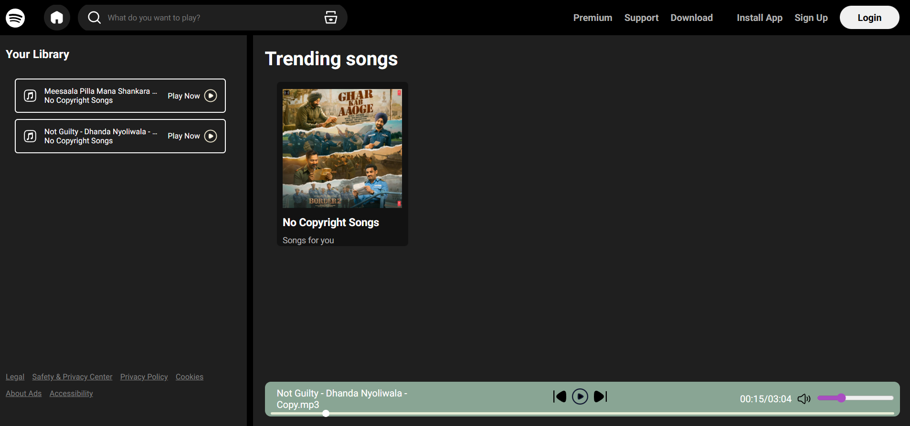
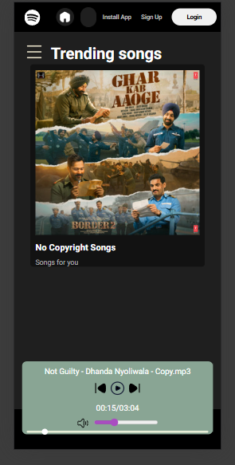

# 🎵 Spotify Clone

A fully responsive Spotify-inspired music player built using **HTML, CSS, and JavaScript**.

🔗 **Live Demo:**  
https://spotify-clone-theta-orpin-85.vercel.app/

---

## 📸 Screenshots

### 🖥 Desktop View


### 📱 Mobile View


---

## ✨ Features

- 🎧 Dynamic album loading using JSON
- ▶️ Music playback with play/pause
- ⏭ Next / Previous navigation
- 🔊 Volume control & mute
- 💾 Remembers last played song (localStorage)
- 📱 Fully responsive design
- 🎨 Clean Spotify-like UI

---

## 🛠 Tech Stack

- HTML5  
- CSS3  
- JavaScript  
- Vercel (Deployment)

---

## 📂 Project Structure

spotify-clone/
│
├── css/
├── img/
├── javascript/
├── songs/
│ ├── albums.json
│ └── ncs/
│ ├── info.json
│ ├── cover.jpg
│ └── *.mp3
├── index.html
└── README.md


---

## ⚙️ Run Locally

```bash
git clone https://github.com/jayprakashm578/spotify-clone.git
cd spotify-clone
```
Open with Live Server or any static server.

No build step required.

## 🧠 Key Learnings
- Dynamic DOM manipulation
- Async data loading using Fetch API
- Debugging production path issues
- Managing application state with localStorage
- Static site deployment on Vercel
- Clean folder structuring for scalable frontend projects

## 🔮 Future Improvements
- 🔍 Search functionality
- 🔀 Shuffle / Repeat mode
- ❤️ Favorites system
- 👤 User authentication
- 🌐 Full-stack backend integration (Node + Express)
- ⚛️ React version

## 👨‍💻 Author
Jaya Prakash Mohanty
GitHub: https://github.com/jayprakashm578   